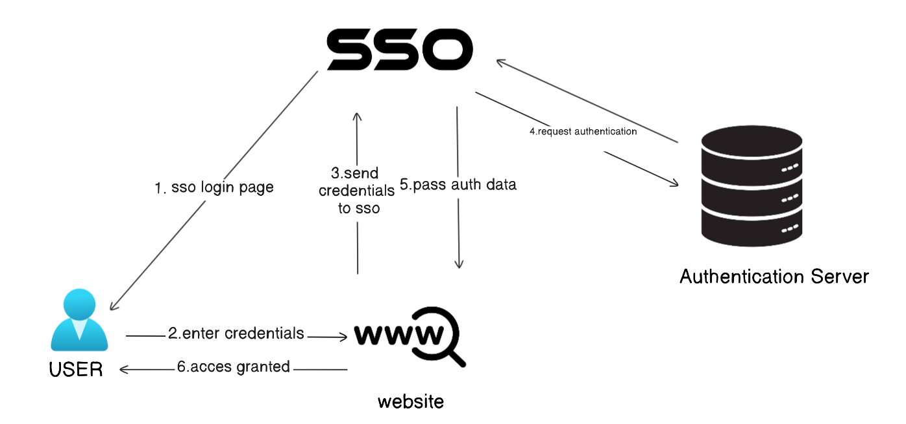
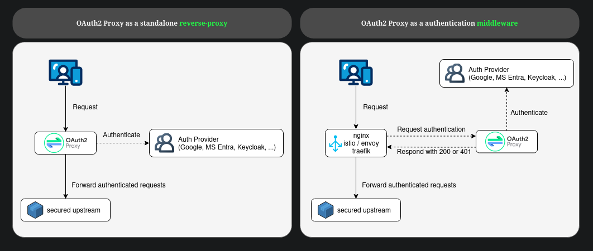
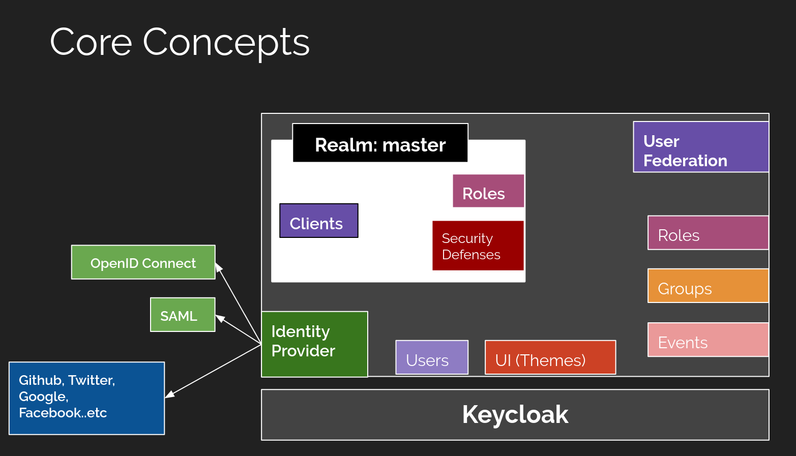
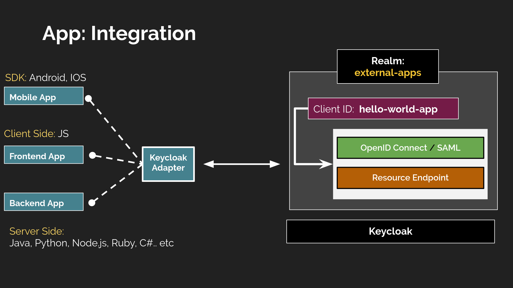
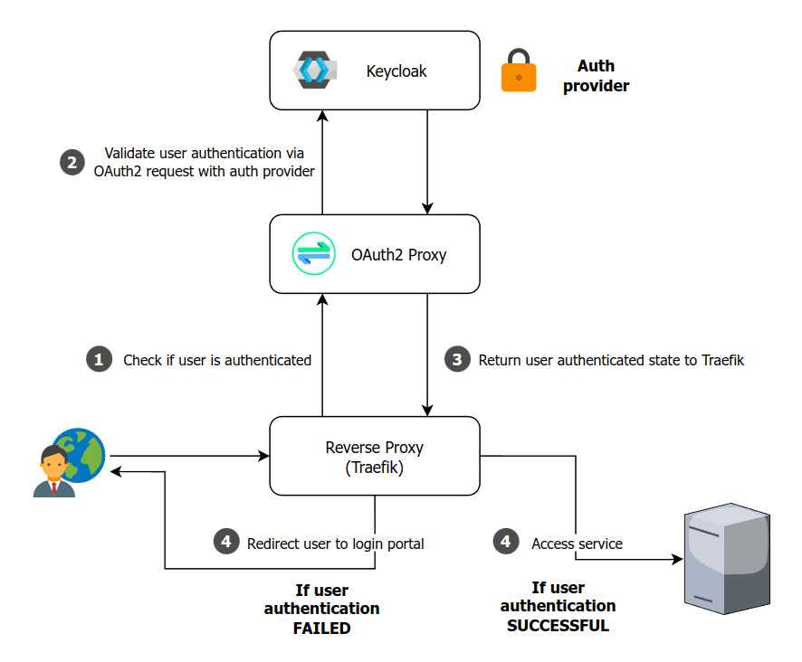

#  SSO Authentication & Authorization

A production-ready Single Sign-On implementation using OpenID Connect (OIDC) Keycloak and OAuth 2.0 protocols in k8s.

Configuration examples: /config-examples

#### Note
This project implements GitOps principles using ArgoCD with the App of Apps pattern for declarative Kubernetes deployments
A single root ArgoCD application manages all infrastructure components as child applications. Each component is defined as an independent ArgoCD application.

---

---
**Single Sign-On (SSO):** authentication scheme that allows users to log in once and access multiple applications without re-entering credentials

### Core Concepts

**Authentication vs Authorization**

| Authentication | Authorization |
|---------------|---------------|
| Verifies **who** you are | Determines **what** you can access |
| "Are you Ghosty?" | "Can Ghosty access this resource?" |
| Identity verification | Permission management |

### How It Works

---

##  Why Use SSO?

### User Benefits
-  **One login** for all applications
-  **No password fatigue** - fewer passwords to remember
-  **Faster access** - seamless transitions between apps
-  **Better UX** - reduced login friction

### Business Benefits
-  **Enhanced Security** - Centralized authentication, stronger policies
-  **Cost Savings** - 50% fewer support tickets, ~$70 saved per password reset
-  **Instant Revocation** - Disable access across all apps immediately
-  **Compliance** - Simplified GDPR, SOC 2 compliance
-  **Productivity** - Users save 5-15% time on authentication

### Technical Benefits
-  **Scalability** - Easy to add new applications
-  **Maintainability** - Centralized authentication logic
-  **Industry Standards** - Built on OAuth 2.0 and OpenID Connect
-  **Flexibility** - Support for MFA, RBAC, multiple providers

---

# OAuth2 Proxy ~ Keycloak ~ Kubernetes

A deep-dive into OAuth2 Proxy, Keycloak, and their deployment patterns in Kubernetes environments.

---

##  Table of Contents

- [OAuth2 Proxy](#-oauth2-proxy)
- [Keycloak](#-keycloak)
- [OAuth2 Proxy + Keycloak Combined](#-oauth2-proxy--keycloak-combined)
- [Kubernetes Deployment](#-kubernetes-deployment)

---

## OAuth2 Proxy

**OAuth2 Proxy** is a reverse proxy and static file server that provides authentication using OAuth 2.0 providers (Google, GitHub, Azure, Keycloak, etc.) to validate accounts by email, domain, or group.

**In simple terms:** It sits in front of your application and handles authentication before requests reach your app. Think of it as a security gate that checks credentials before letting users through.

### Key Features

-  **Reverse Proxy** - Intercepts requests before they reach your application
-  **Multiple Providers** - Google, GitHub, Azure AD, Keycloak, Okta, and more
-  **Email/Domain Validation** - Restrict access by email or domain
-  **Lightweight** - Single binary, minimal resource usage
-  **Stateless** - No database required (uses cookies/Redis for sessions)
-  **Header Injection** - Passes user info to backend via HTTP headers

https://oauth2-proxy.github.io/oauth2-proxy

### Use Cases

**Perfect for:**
- Adding authentication to legacy apps without code changes
- Protecting internal tools and dashboards
- Securing static sites
- Quick SSO implementation without modifying application code
- Microservices authentication gateway

**Not ideal for:**
- Applications needing fine-grained authorization (use proper RBAC)
- Complex user management (use full IdP like Keycloak)
- When you need full identity provider features

### How It Works

1. User requests protected resource
2. OAuth2 Proxy checks for valid session cookie
3. If not authenticated, redirects to IdP (Keycloak/Google/etc.)
4. User authenticates with IdP
5. IdP redirects back with authorization code
6. OAuth2 Proxy exchanges code for tokens
7. OAuth2 Proxy sets session cookie
8. OAuth2 Proxy proxies request to backend with user headers

### Configuration Example

Basic OAuth2 Proxy config structure:
- **Provider** - Which OAuth provider to use
- **Client ID/Secret** - OAuth application credentials
- **Redirect URL** - Callback after authentication
- **Upstream** - Backend application URL
- **Email domains** - Allowed domains (e.g., @company.com)
- **Cookie settings** - Session management

### Learning Resources

**Official Documentation:**
- [OAuth2 Proxy GitHub](https://github.com/oauth2-proxy/oauth2-proxy) - Main repository
- [OAuth2 Proxy Documentation](https://oauth2-proxy.github.io/oauth2-proxy/) - Complete documentation
- [Configuration Guide](https://oauth2-proxy.github.io/oauth2-proxy/docs/configuration/overview) - All configuration options
- [Provider Configuration](https://oauth2-proxy.github.io/oauth2-proxy/docs/configuration/oauth_provider) - Setting up different providers

**Tutorials & Guides:**
- [OAuth2 Proxy with Nginx Tutorial](https://oauth2-proxy.github.io/oauth2-proxy/docs/tutorials/nginx-ingress) - Nginx integration
- [Securing Apps with OAuth2 Proxy](https://www.talkingquickly.co.uk/webapp-authentication-keycloak-OAuth2-proxy-nginx) - Practical guide
- [OAuth2 Proxy + Google Auth](https://pusher.com/tutorials/google-auth-proxy/) - Google provider setup
- [Medium: Understanding OAuth2 Proxy](https://medium.com/@mailtoravi.in/oauth2-proxy-with-keycloak-b0c82622ca3f) - Keycloak integration

**Advanced Topics:**
- [Redis Session Storage](https://oauth2-proxy.github.io/oauth2-proxy/docs/configuration/session_storage) - Distributed sessions
- [Header Injection](https://oauth2-proxy.github.io/oauth2-proxy/docs/configuration/overview#upstreams-configuration) - Passing user data
- [JWT Verification](https://oauth2-proxy.github.io/oauth2-proxy/docs/configuration/overview#jwt-token-verification) - Token validation

---

##  Keycloak

**Keycloak** is an open-source Identity and Access Management (IAM) solution that provides:
- Single Sign-On (SSO)
- Identity Brokering (social login)
- User Federation (LDAP/Active Directory)
- Fine-grained Authorization
- User Management

**In simple terms:** Keycloak is a complete identity provider that manages users, handles authentication, and provides authorization. It's like having your own Auth0 or Okta.

### Key Features

-  **Full-Featured IdP** - Complete OAuth 2.0, OpenID Connect, SAML 2.0 support
-  **User Management** - Built-in user registration, password policies, MFA
-  **Social Login** - Google, Facebook, GitHub, LinkedIn integration
-  **LDAP/AD Integration** - Connect to existing user directories
-  **Fine-Grained Authorization** - Role-based and attribute-based access control
-  **Scalable** - Clustering support for high availability
-  **Customizable** - Themes, extensions, custom authenticators
-  **Multi-Tenancy** - Multiple realms for different applications/organizations

https://developers.redhat.com/blog/2019/12/11/keycloak-core-concepts-of-open-source-identity-and-access-management#

**Realms** - Isolated namespaces for managing users/apps (like tenants)  
**Clients** - Applications that use Keycloak for authentication  
**Users** - End users who authenticate  
**Roles** - Permissions assigned to users  
**Groups** - Collections of users with shared roles  
**Identity Providers** - External authentication sources  
**Client Scopes** - Reusable sets of protocol mappers and roles

### Use Cases

**Perfect for:**
- Enterprise SSO across multiple applications
- Centralized user management
- Social login integration
- LDAP/Active Directory integration
- Fine-grained authorization requirements
- Multi-tenancy (SaaS applications)
- Compliance requirements (audit logs, security policies)

**Not ideal for:**
- Simple, single-app authentication (might be overkill)
- Extremely high performance requirements (consider simpler solutions)
- When you don't need user management

https://developers.redhat.com/blog/2019/12/11/keycloak-core-concepts-of-open-source-identity-and-access-management#

### Realm-import example:

see here: [config-examples](./config-examples)

### Learning Resources

**Official Documentation:**
- [Keycloak Official Website](https://www.keycloak.org/) - Homepage
- [Keycloak Documentation](https://www.keycloak.org/documentation) - Complete docs
- [Getting Started Guide](https://www.keycloak.org/getting-started) - Quick start
- [Server Administration Guide](https://www.keycloak.org/docs/latest/server_admin/) - Comprehensive admin guide
- [Securing Applications](https://www.keycloak.org/docs/latest/securing_apps/) - Integration guide
- [Authorization Services](https://www.keycloak.org/docs/latest/authorization_services/) - Fine-grained authorization

**Architecture & Concepts:**
- [Server Installation](https://www.keycloak.org/docs/latest/server_installation/) - Deployment options
- [Clustering Guide](https://www.keycloak.org/docs/latest/server_installation/#_clustering) - High availability
- [Database Setup](https://www.keycloak.org/docs/latest/server_installation/#_database) - Supported databases
- [Keycloak Concepts](https://www.keycloak.org/docs/latest/server_admin/#core-concepts-and-terms) - Understanding realms, clients, roles

**Extensions & Customization:**
- [Keycloak Extensions](https://github.com/keycloak/keycloak/tree/main/examples) - Official examples
- [Custom Themes](https://www.keycloak.org/docs/latest/server_development/#_themes) - UI customization
- [Event Listeners](https://www.keycloak.org/docs/latest/server_development/#_events) - Custom event handling
- [Custom Authenticators](https://www.keycloak.org/docs/latest/server_development/#_auth_spi) - Authentication flows

**Integration Examples:**
- [Java/Spring Boot](https://www.keycloak.org/docs/latest/securing_apps/#_spring_boot_adapter) - Spring integration
- [Node.js](https://www.keycloak.org/docs/latest/securing_apps/#_nodejs_adapter) - Node.js adapter
- [Python/Flask](https://github.com/akhilputhiry/keycloak-python) - Python integration
- [React/Angular](https://www.npmjs.com/package/keycloak-js) - Frontend integration

---

##  OAuth2 Proxy + Keycloak Combined

### Why Combine Them?

**The Power Duo:** OAuth2 Proxy handles authentication gateway, Keycloak provides identity management.

### Benefits of This Combination

**Separation of Concerns:** OAuth2 Proxy acts as an authentication gateway (reverse proxy), while Keycloak serves as the identity provider handling user management and SSO.

**Flexibility:** Protect multiple applications with a single OAuth2 Proxy instance, maintain centralized user management in Keycloak, and easily add or remove applications as needed.

**Enhanced Security:** OAuth2 Proxy validates tokens before requests reach your applications, Keycloak handles complex authentication flows, and this creates an additional layer of protection.

**Simplified App Development:** Applications don't need authentication logic built-in, OAuth2 Proxy injects user information via headers, and Keycloak handles all user management tasks.

**Scalability:** Both components scale independently, Keycloak supports clustering for high availability, and OAuth2 Proxy remains stateless when using Redis for session storage.

### When to Use This Combination

**Use when:**

1. **Multiple Applications Need Protection**
   - You have several apps/services needing authentication
   - You want centralized SSO across all apps
   - Apps are legacy or can't be easily modified

2. **Enterprise Requirements**
   - Need LDAP/Active Directory integration
   - Require fine-grained user management
   - Need audit logs and compliance features
   - Social login + enterprise authentication

3. **Microservices Architecture**
   - Multiple services need authentication
   - Want to avoid implementing auth in each service
   - Need API gateway pattern with authentication

4. **Kubernetes Deployments**
   - Running services in K8s
   - Using Ingress for routing
   - Want to add authentication to Ingress routes

5. **Development/Testing Environments**
   - Quick SSO setup for internal tools
   - Protect staging/dev environments
   - Cost-effective compared to managed solutions

### When NOT to Use This Combination

**Avoid when:**

1. **Single, Simple Application**
   - Just one app with basic auth needs
   - No user management required
   - Adds unnecessary complexity

2. **Already Using Managed IdP**
   - Auth0, Okta, Azure AD already in place
   - No need for self-hosted solution
   - Managed service handles everything

3. **Extreme Performance Requirements**
   - Every millisecond matters
   - Additional proxy hop is unacceptable
   - Direct app-to-IdP integration preferred

4. **Resource Constraints**
   - Limited infrastructure/budget
   - Can't maintain two systems
   - Simple solutions available

5. **Complex Authorization Needs in App**
   - App needs fine-grained, context-aware authorization
   - Better to implement in application layer
   - OAuth2 Proxy only does authentication

### Alternative Approaches

**Keycloak Alone:** Apps integrate directly with Keycloak using Keycloak adapters and libraries, which is better for complex authorization requirements.

**OAuth2 Proxy with Managed IdP:** Combine OAuth2 Proxy with Auth0 or Okta for less maintenance and better support.

**API Gateway with Built-in Auth:** Use Kong with OIDC plugin, Ambassador with Auth service, or other integrated solutions.

**Service Mesh:** Deploy Istio or Linkerd for built-in mTLS and authentication, though this is more comprehensive but also more complex, suitable for large microservices deployments.

### Configuration Pattern

**Typical setup flow:**

1. **Deploy Keycloak**
   - Create realm (e.g. "my-company")
   - Create client for OAuth2 Proxy
   - Configure users/roles

2. **Configure OAuth2 Proxy**
   - Point to Keycloak as provider
   - Set client ID/secret from Keycloak
   - Configure upstream apps

3. **Setup Applications**
   - No changes needed to app code
   - OAuth2 Proxy passes user info via headers
   - Apps read headers for user identity

### Learning Resources

**Integration Guides:**
- [OAuth2 Proxy with Keycloak Guide](https://www.talkingquickly.co.uk/webapp-authentication-keycloak-OAuth2-proxy-nginx) - Complete tutorial
- [Medium: OAuth2 Proxy + Keycloak](https://medium.com/@mailtoravi.in/oauth2-proxy-with-keycloak-b0c82622ca3f) - Step-by-step
- [OAuth2 Proxy Keycloak Provider](https://oauth2-proxy.github.io/oauth2-proxy/docs/configuration/oauth_provider#keycloak-oidc-auth-provider) - Official docs
- [Securing Apps with Keycloak and OAuth2 Proxy](https://devpress.csdn.net/k8s/62f4e7a97e6682346618a2e4.html) - Practical guide

**Architecture Patterns:**
- [Microservices Authentication Patterns](https://www.nginx.com/blog/microservices-reference-architecture-nginx-oauth2-authentication/) - NGINX blog
- [API Gateway Authentication](https://www.keycloak.org/docs/latest/securing_apps/#_api-gateway) - Keycloak docs
- [Zero Trust Architecture](https://www.cncf.io/blog/2021/03/12/implementing-zero-trust-in-kubernetes/) - CNCF blog

---

##  Kubernetes Deployment

Kubernetes provides the perfect environment for deploying OAuth2 Proxy + Keycloak:

- **Scalability** - Auto-scale based on load
- **High Availability** - Multi-replica deployments
- **Service Discovery** - Built-in DNS and load balancing
- **Configuration Management** - ConfigMaps and Secrets
- **Ingress** - Native integration with OAuth2 Proxy
- **Rolling Updates** - Zero-downtime deployments

  

### Deployment Components

**1. Ingress Controller**
- Entry point for external traffic
- Handles TLS termination
- Routes requests to OAuth2 Proxy
- Popular choices: NGINX Ingress, Traefik, Istio Gateway

**2. OAuth2 Proxy Deployment**
- Stateless application (easily scalable)
- Typically 2+ replicas for HA
- ConfigMap for configuration
- Secret for cookie/client secrets
- Service (ClusterIP) for internal access

**3. Keycloak StatefulSet**
- Needs persistent database connection
- Can run multiple replicas with clustering
- Requires PostgreSQL/MySQL database
- Uses PersistentVolumeClaim for data
- Service (ClusterIP) for internal access
- Optional: External Service/Ingress for admin console

**4. Database (PostgreSQL/MySQL)**
- StatefulSet for stability
- PersistentVolume for data persistence
- Backup strategy essential
- Consider managed database for production

**5. Application Deployments**
- Your protected applications
- No auth code needed
- Read user info from headers injected by OAuth2 Proxy

## RESULTS:

**see here: [results](docs/results.md)**

### Learning Resources

**Kubernetes + OAuth2 Proxy:**
- [OAuth2 Proxy on Kubernetes](https://oauth2-proxy.github.io/oauth2-proxy/docs/deployment/kubernetes) - Official guide
- [OAuth2 Proxy Helm Chart](https://github.com/oauth2-proxy/manifests) - Helm deployment
- [NGINX Ingress External Auth](https://kubernetes.github.io/ingress-nginx/examples/auth/oauth-external-auth/) - Integration guide
- [Traefik Forward Auth](https://doc.traefik.io/traefik/middlewares/http/forwardauth/) - Traefik integration

**Kubernetes + Keycloak:**
- [Keycloak on Kubernetes](https://www.keycloak.org/operator/installation) - Official operator
- [Keycloak Operator Documentation](https://www.keycloak.org/operator/basic-deployment) - Operator guide
- [Bitnami Keycloak Helm Chart](https://github.com/bitnami/charts/tree/master/bitnami/keycloak) - Production-ready chart
- [Codecentric Keycloak Helm Chart](https://github.com/codecentric/helm-charts/tree/master/charts/keycloak) - Alternative chart

