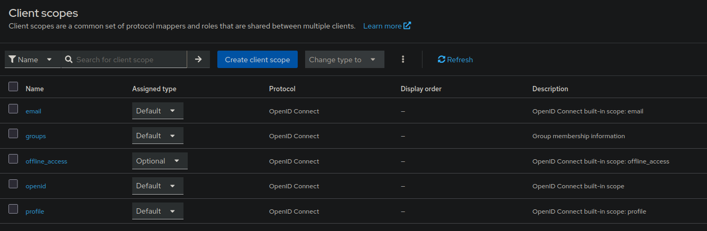

# Results for test:

# Clients

# Users

# Scopes

## Components Deployed

### 1. Keycloak
- Centralized user management and SSO
- Handles authentication flows
- Provides OAuth2/OIDC tokens

### 2. OAuth2 Proxy
- Acts as reverse proxy
- Validates authentication before app access
- Injects user headers to backend apps

### 3. Test Applications

**NGINX Test App**
- Simple application to verify authentication flow
- Protected by OAuth2 Proxy
- No authentication code needed in the app

**Grafana**
- Uses Keycloak as built-in OAuth provider
- Direct integration with Keycloak
- Demonstrates native OAuth2 authentication

